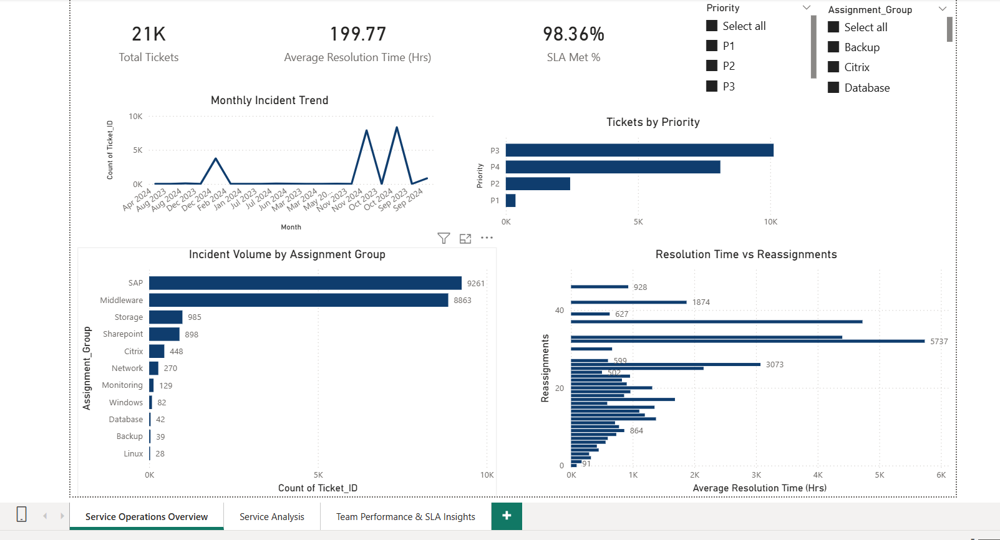
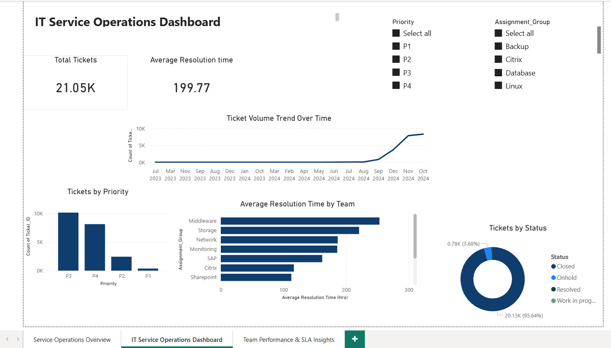
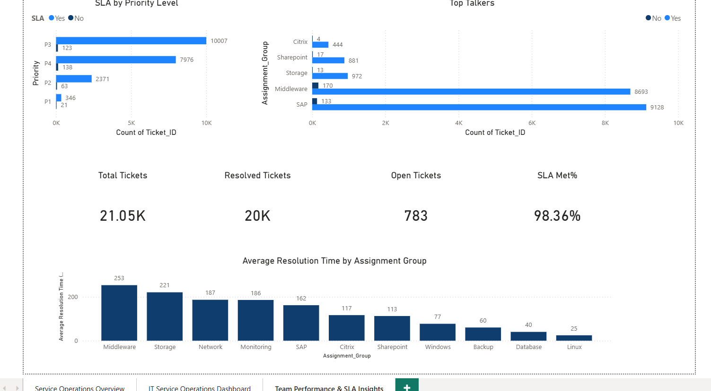

# 📊 Power BI & ITSM Portfolio — Narmadha Govindaraj

🎯 ITIL® v4 Certified ITSM Analyst | Power BI Developer | 4+ Years @ Accenture
📧 narmadhagovindaraj684@gmail.com
🔗 [LinkedIn](https://www.linkedin.com/in/narmadha-govindaraj)

---

## 📁 Dashboard 1: Incident Management Dashboard


### 🛠️ Tools Used
Power BI Desktop | DAX | Power Query | ServiceNow Data

### 📊 Key Metrics
| Metric | Value |
|---|---|
| Total Incidents | 21K |
| Closed Incidents | 21.05K |
| SLA Compliance | 98.77% |
| MTTR | 6 Hrs |
| INC related to Changes | 317 |

### 💡 Business Impact
- Used in weekly governance reviews with senior leadership
- Identified SAP & Middleware as highest-volume towers
- MTTR tracking contributed to 25% reduction in resolution time
- SLA donut enabled real-time breach risk monitoring

---

## 📁 Dashboard 2: IT Service Operations — 3 Page Report

### 🗂️ Page 1: Service Operations Overview


**Highlights:**
- 21K total tickets | 98.36% SLA Met | Avg Resolution 199.77 Hrs
- Monthly Incident Trend with peak identification
- SAP (9,261) & Middleware (8,863) as top volume towers
- Resolution Time vs Reassignments — advanced scatter analysis

---

### 🗂️ Page 2: IT Service Operations Dashboard


**Highlights:**
- Ticket Volume Trend Over Time (Jul 2023 → Oct 2024)
- Average Resolution Time by Team — Middleware highest at 253 Hrs
- Tickets by Status — 95.64% Closed, 3.68% On Hold
- Priority breakdown across P1–P4

---

### 🗂️ Page 3: Team Performance & SLA Insights


**Highlights:**
- SLA by Priority — P3: 10,007 Met vs 123 Breached
- Top Talkers — SAP (9,128 Yes) & Middleware (8,693 Yes)
- 4 KPI cards — 21.05K Total | 20K Resolved | 783 Open | 98.36% SLA
- Resolution Time by Group — Middleware (253) → Linux (25)

---

### 🛠️ Tools Used Across Both Dashboards
| Tool | Usage |
|---|---|
| Power BI Desktop | Dashboard design & development |
| DAX | SLA Met %, MTTR, Resolved/Open ticket measures |
| Power Query | Data transformation & cleansing |
| ServiceNow | Source data (Incident, SLA, Assignment data) |
| Power Automate | Automated report delivery & SLA alerts |

### 📊 Combined Key Metrics
| Metric | Value |
|---|---|
| Total Tickets Analysed | 21.05K |
| SLA Compliance Rate | 98.36% |
| Resolved Tickets | 20K |
| Open Tickets | 783 |
| Avg Resolution Time | 199.77 Hrs |
| Top Volume Tower | SAP — 9,261 tickets |
| Highest Res. Time Team | Middleware — 253 Hrs |

---

## 🛠️ Skills Demonstrated
- ✅ DAX Measures (SLA %, MTTR, Open/Resolved counts)
- ✅ Power Query data transformation
- ✅ Multi-page report design
- ✅ KPI Card, Bar, Line, Donut chart visuals
- ✅ Interactive slicers (Priority, Assignment Group, Year, Month)
- ✅ Time intelligence (trend over time)
- ✅ SLA compliance monitoring
- ✅ ITSM metrics — P1/P2/P3/P4 analysis

---

## 📜 Certifications
- 🏅 ITIL® 4 Foundation — IT Service Management (AXELOS)
- 🏅 Microsoft Certified: Azure Fundamentals AZ-900 (Microsoft)
- 🏅 Accenture Datacool — Data Analytics & Reporting
-  🏅 Microsoft Certified: PL-300 Power BI Data Analyst

```
https://github.com/Narmadha2611/power-bi-itsm-portfolio
