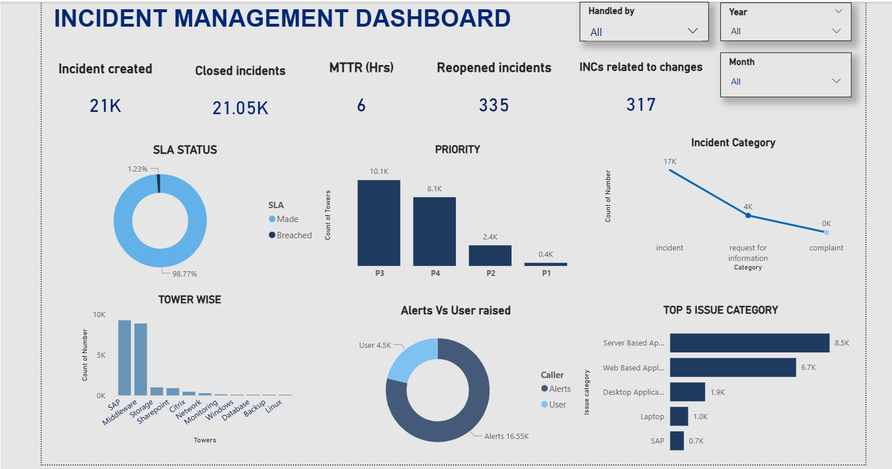

# 📊 Power BI & ITSM Portfolio — Narmadha Govindaraj

🎯 ITIL® v4 Certified ITSM Analyst | Power BI Developer | 4+ Years @ Accenture  
📧 narmadhagovindaraj684@gmail.com  
🔗 [LinkedIn](https://www.linkedin.com/in/narmadha-govindaraj)

---

## 📌 Dashboard 1: Incident Management Dashboard



### 🛠️ Tools Used
> Power BI Desktop | DAX | Power Query | ServiceNow Data

### 📊 Key Metrics Tracked
| Metric | Value |
|---|---|
| Total Incidents Created | 21K |
| Closed Incidents | 21.05K |
| SLA Compliance Rate | 98.77% |
| MTTR | 6 Hrs |
| INC related to Changes | 317 |

### 📌 Visuals Included
- ✅ SLA Status (Donut) — 98.77% compliance rate
- ✅ Priority Breakdown — P1 to P4 distribution
- ✅ Tower-wise Incident Volume — SAP, Middleware, Storage & more
- ✅ Alerts vs User-raised split — 79% system alerts
- ✅ Top 5 Issue Categories — for Problem Management input
- ✅ Incident Category line chart
- ✅ Slicers — Handled By, Year, Month

### 💡 Business Impact
- Dashboard used in weekly governance reviews with senior leadership
- Identified SAP & Middleware as highest-volume towers
- MTTR tracking contributed to **25% reduction** in resolution time
- SLA donut enabled real-time breach risk monitoring

---

## 🛠️ Skills Demonstrated
- DAX Measures & Calculated Columns
- Power Query (M Language) transformations
- KPI Card design and layout
- Multi-slicer interactive filtering
- ServiceNow data visualization
- ITSM metrics reporting

---

## 📜 Certifications
- 🏅 ITIL® 4 Foundation — IT Service Management
- 🏅 Microsoft Certified: Azure Fundamentals (AZ-900)
- 🏅 Accenture Datacool — Data Analytics & Reporting

---
*More dashboards coming soon — SLA Trend Report | Change Management KPI | Problem Management Analysis*
```
https://github.com/Narmadha2611/power-bi-itsm-portfolio
